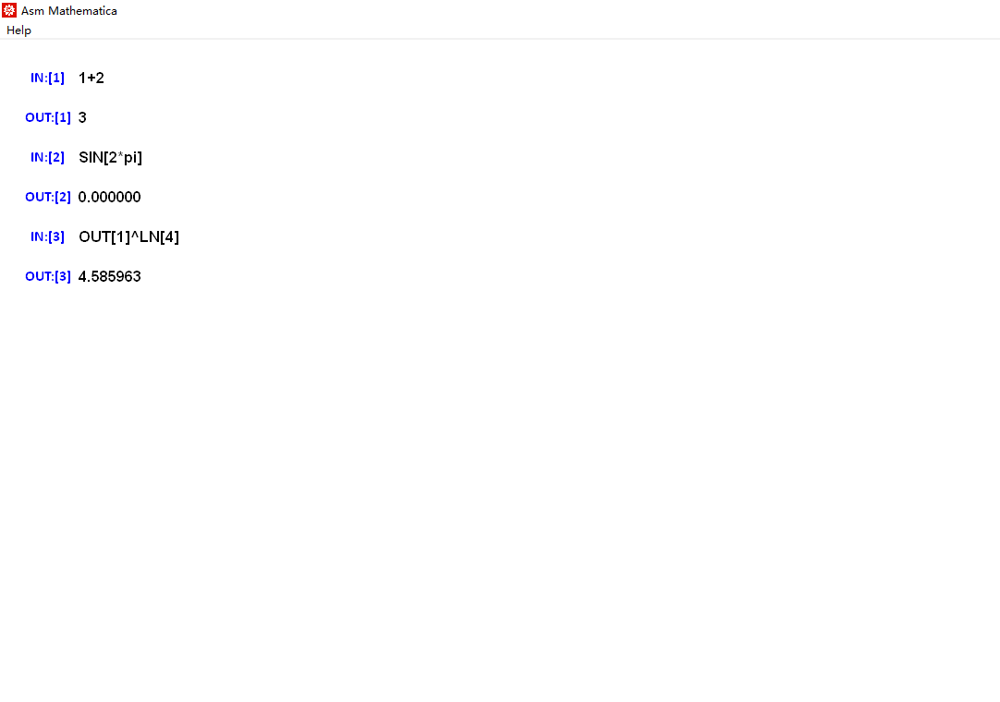

## 汇编大作业说明文档  
### 开发环境  
* 操作系统：Windows 10  
* IDE：Visual Studio  
* 汇编器：MASM  
***
### 难点与创新点  
这里首先陈述难点与创新点，之后的实现原理部分也会按此处的逻辑进行讲述。我们项目的难点/创新点有如下若干项：  
1. 图形界面：在界面上管理多个输入框，维护计算输入/计算结果的显示，提供滚动条等；  
2. 表达式处理：正确解析用户输入的任意算式，并能处理算符的优先级等关系，为下一步计算打下基础；  
3. 计算逻辑：处理各种参数与算符，在得出正确结果的同时保证程序的鲁棒性；  
4. 变量处理：支持变量的定义与使用，在算式中考虑变量并正确计算结果，以丰富用户的使用体验。  
***
### 实现原理  
下面分别展开讲述各难点与创新点的原理。鉴于这些点本身也都比较复杂，我们将重点描述实现思路与实现过程中的关键步骤。  
#### 图形界面   
图形界面的实现基于 Win32 API，原理较为简单，其主要结构如下。  
整个页面由可变数量的子窗口组成，该子窗口为自定义窗口，命名为RowBow(以下称为Box)，每个Box又是由两个子控件组成，一个文本编辑框用于交互，以及一个静态文本框用于显示计算历史。这部分窗口的逻辑都通过调用win32 API实现。  
程序初始会包含一个Box用于第一次输入，之后的新Box产生逻辑为：无论用户在哪一个Box中进行了计算，都需要保证其下方还有一个Box(用于放置输出结果)，以及最下方仍有一个空白的Box(用于空白的新输入)。  
因此，若计算发生在最后一个Box，则在末尾产生两个新的Box；若计算发生在倒数第二个Box，则在其下方产生一个新的Box。其余情况则无需生成新Box。  
还有一点值得提及的是，生成Box时程序会始终维护最后一个Box的高度为占满屏幕，这样用户可以直接点击空白区域并进行输入，其余的输入框的高度则均为固定值。   
在用户按下Enter键进行计算时，图形部分的程序会将当前输入框中的文本传递给负责计算逻辑的函数，而计算完成后计算部分会更新一个指定的字符串，图形部分程序再从这段字符串获取计算结果并更新下方输入框与计算历史文本的显示。  
下面是一个图形界面的样例：  
  
***
#### 表达式处理   
表达式处理的核心是将正常的数学算式转化为逆波兰表达式，从而让之后的计算能通过栈操作进行。  
在参考了[这篇文章](https://zhuanlan.zhihu.com/p/357982040)，我们得知了逆波兰表达式的转化方法如下：  
1. 所有算术步骤加上括号，表明优先级。这一步去除了符号与符号间的优先级关系，计算先后顺序依照括号进行。如：乘除要优先于加减。  
2. 将括号内的符号移动到被包裹的最内层的右括号之后。  
3. 去掉括号即可。  

下面分析一下这三步的实现。  
##### 前戏：算符表  
在加括号前便会显现的一个问题是，我们要先找到算符，为此需要开设一张表记录运算符的情况。这张表应该包含所有算符，同时表现出算符的优先级。  
首先我们对算符进行了分类：按算符需要的操作数可以分为一元与二元运算符，按形式则可以分为函数与算符。形式上算符为特殊字符，函数则为大写字母串。我们认为函数也是一种算符，这样能大大增多我们程序支持的功能，也使得之后的处理更加统一。  
算符表被组织为一个二维BYTE数组，其实质为一定长度的一维BYTE字串，每行(这里的行即一定长度的字符串)存储若干算符，这些算符具有相同的优先级；整个字串则包含若干行，越靠前的行优先级越高。  
除此之外相应地设置了一个辅助表，用于记录上面描述到的算符的类型。  
我们还设置了一个功能性函数用于查找并匹配算符，该函数在之后的处理中被广泛使用。  
##### 加括号  
通过上面的算符识别函数，我们可以在算式中找到所有的算符，然后根据算符表中的优先级，将算符加上括号。  
具体而言，我们逐行对算符表进行处理，每次处理一行，为该行中的算符加上括号。通过从算符所在的位置向左/右查找，我们可以确定括号应该出现的位置。以二元算符的右半括号为例，初始指针在算符右侧：  
* 若此时指针指向的值已经是一个左括号：说明左侧是一个被括号包裹的区域，此时可以采用遍历并统计左/右括号数量的方式，找到原本左括号对应的右括号位置，此处即是正确的插入右括号位置。  
* 若此时指针指向的是一个正常的值，则说明左侧是一个正常的操作数，在经过这个操作数之后加上括号即可。  

对于左半括号以及其他种类的算符格式操作类似。在完成了加括号功能后，逐行处理算符添加括号就能达成考虑算符优先级的目的。  
##### 移动算符与去括号  
上面提到的加括号步骤已经包括了一个简单的思想：向某一方向遍历时统计两个方向的括号即可找到括号的位置。此处的移动算符也是类似的思路，由于算符本身已经在一对括号之中，所以统计二者数量差值时的初值应为1。  
此处的移动还有一点细节：我们需要在合适的位置插入空格，以方便后续栈处理时的读取。最简单的想法是每次移动算符就在原本的位置加入一个空格，但这样会导致算符之间的空格数量不一致，因此我们按算符的类型分别进行处理。  
对于一元算符/函数，我们在将其移动到右侧后，再在其左侧加入一个空格即可。对于二元运算符我们采用上面的空格插入方式，二元函数的处理较为特殊，我们将其移动至最后的同时将中间的分隔符逗号替换为空格。  
至此，完成的表达式已经是规整且已处理的。作为示例，考虑算式`1+2*3-4`，其处理流程如下：  
1. 逐行加括号  `1+2*3-4 -> 1+(2*3)-4 -> ((1+(2*3))-4)`  
2. 移动算符并生成空格  `((1+(2*3))-4) -> 1 2 3 * + 4 -`  
***
#### 计算逻辑  
得到逆波兰表达式后就可以开展计算了，这里又要分为几个步骤：  
1. 维护计算用的栈，该栈为自定义栈并存储计算需要的一切信息；  
2. 读取逆波兰表达式，将其转化为栈上操作；  
3. 根据不同的算符进行不同的计算逻辑；  
4. 解析结果并输出。  

我们仍然逐步分析。  
##### 维护栈与栈上协议  
有关栈的实现在文件`mathStack.asm`中，首先我们创建一个大数组，模拟了一个栈的空间，同时设立两个值作为栈顶与栈底的指针，这部分的思路与程序运行栈类似。  
我们接受的输入可能是多种多样的，为了支持后续的操作，我们规定了一个栈上的协议来实现信息的分类区分。  
协议规定一个数据由三部分组成：数据类型，数据大小，数据体。其中数据类型为一个BYTE，数据大小为一个WORD，数据体为一个不定长的数据段，根据数据类型和大小的不同而决定长度。三者在栈上紧密排列，数据体在栈靠近底部的位置，数据大小在中间，数据类型在顶部，这样排列才能支持栈的弹出操作。  
有了协议之后我们封装了计算栈上的push和pop操作，统一完成了元素的压栈与弹栈。我们同时提供了用于读取顶部元素的函数，可以在不弹出元素的条件下获知元素情况，方便后续的计算过程实现。    
作为具体实现的示例，考虑读取顶部元素值的函数，我们首先读取数据类型和大小，然后从栈顶的位置向下移动n+3个字节(此处的n为数据大小)，此处便是数据段开始的地址，再利用strncpy等函数就能将目标数据拷贝到传入的地址，实现数据的读取。  
##### 读取表达式并操作  
有了栈的支持，我们就可以开始读取表达式并进行操作了。读取较为简单，只要按照逆波兰表达式中的顺序正向遍历检测，在碰到一个元素/算符时调用相应的函数即可。首先判断碰到的是元素还是算符，我们先来讨论前者。  
此处的细节问题在于如何处理遇到的元素。我们按如下方法检测元素类型：  
* 若元素中包含小写字母，则为变量；  
* 若元素中包含小数点.，则为浮点数；  
* 否则，为整数。  

根据上面的分类逻辑，压入栈时会压入不同的数据类型。数据段则是由原本的字符串转化而来，我们使用sprintf与sscanf函数完成在字符串与数值之间的转换，这样就能获取字符串对应的数值并压入栈中。  
对于算符，我们的处理逻辑为首先获取栈顶的一个元素，并尝试匹配算符表中的一元算符，若匹配成功则进行一元运算，否则再获取一个栈顶元素并尝试匹配二元算符，若匹配成功则进行二元运算，否则进行错误处理。这是一个大致的思路，具体处理时还有些细节问题。  
无论一元还是二元，匹配成功的同时也拿到了需要的元素，这里调用算符对应的计算函数即可。我们会针对不同的数据类型支持不同的计算，同时类型之间还能完成隐式的类型转换，让计算过程尽量合理，因此在获取元素的时候，其实会根据拿到的元素类型再进行分类处理。  
此外，计算过程中发生的错误也应得到处理。栈上的数据类型包含了一个对应错误的类型，当计算过程中发生错误时，我们会将带有着错误类型的元素压入栈中，并且无论何时读取到一个错误类型时，程序都会将这个错误直接压回栈中，保留该错误信息到最后。  
计算过程正常完成后，得到的结果压入栈中即可，在所有的算符/元素都被处理完后，正确的表达式应该使得栈中仅剩一个元素。  
##### 算符计算逻辑  
上面也提到了算符实际执行的操作将与数据类型有关，数据类型之间也能进行转换，我们共有三种较为基本的数据类型：整数、浮点数与布尔值。在发生计算时，算符会有不同的需求，例如：  
* '+'算符需要两个整数/浮点数，返回一个整数/浮点数，若两个操作数中有一个为浮点数，则应将二者都转化为浮点数并使用浮点数加法计算；  
* '&&'算符需要两个布尔值，返回一个布尔值，传入的两个值均应转化为布尔值；  
* '^'算符需要两个整数/一个整数一个浮点数，返回一个整数/浮点数，传入的两个值中第一个值类型不定，第二个值则不能为浮点数，需要转化为整数。  

上面列举的几个例子足以展示问题的复杂性。我们在实现时采用了一种较为简单的思路：布尔值可以任意转换，当值为真时转化为整数1/浮点数1.0，否则转化为0；整数可以转化为浮点数，但浮点数不能隐式转化为整数，这样做是为了保证数值计算时的精度不被舍入影响。  
在保证计算函数都能拿到需要的数据类型后就可以进行计算了，每个算符对应的计算函数不同，这些计算函数大多在`longInt.asm`，`double.asm`和`boolean.asm`中实现，三者分别处理与三种元素类型相关的计算函数实现。  
##### 解析结果与输出  
***
### 与中期相比  
***
### 小组分工  
钟健坤：程序架构实现，图形界面实现，逆波兰表达式转化的实现，栈与表达式计算的实现，报告撰写  
陈者霖：长整数的实现，栈协议的设计与实现，表达式计算的实现，报告撰写  